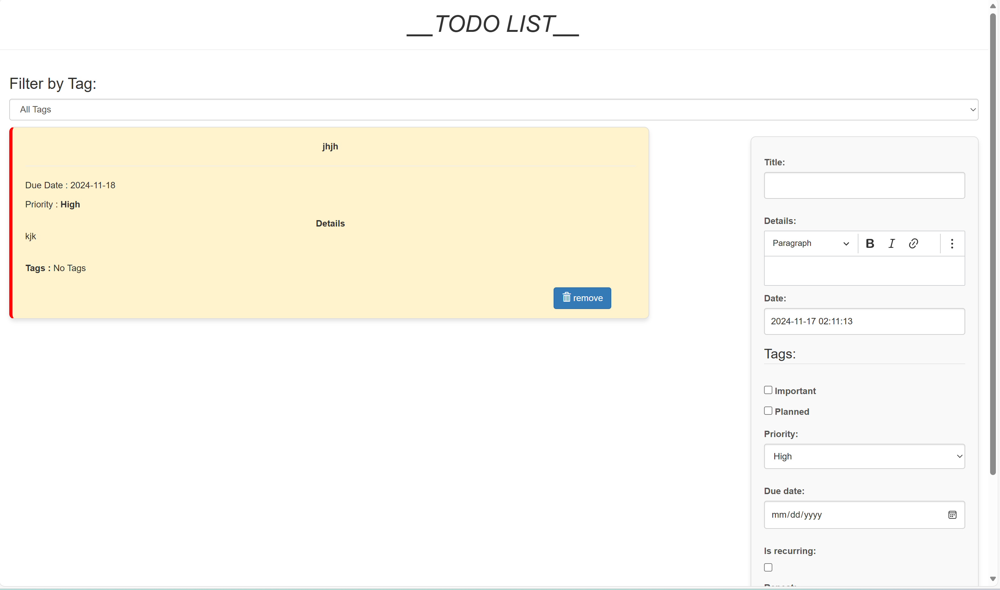

# Documentation

## Administration panel access

username = superadmin \
password = superadmin

## Features Implemented

### Rich Text Feature

We implemented the rich text feature that allows the user to better format the details of a task.

*Before implementation*


*After implementation*


### Sort, Filter and Search Feature

We implemented the sort, filter and search features that allows the user to apply these operations on the todo list elements

*Before implementation*


*After implementation*


### Email Notification

The mail notification system was implemented to send email to user when the due date of the task is near (in this case less than 7 days or a week). To implement this feature there are some requirements first we have to install the django-background-taks using the command below :

`pip install django-background-tasks`

After installing the module we need to add the "background_task" module in the INSTALLED_APPS in [settings.py](/todo_site/todo_site/settings.py#L41-L42). Run the known migrate command to update the database with the new module.

With a proper and complete installation of the background task module we have to move on to designing the logic in the view that plans the task depending on the due date and code the send mail notification task. To do so we write in the views file the following code after saving each task.

```python
task = form.save()
# Send email notification for due tasks
notify_at = task.due_date - timedelta(days=7)
# If the task is due day greater than a week
if notify_at >= now().date():
    notify_at = datetime.combine(notify_at, datetime.min.time())
    send_due_soon_email(task.id, schedule=notify_at)
else:
    send_due_soon_email(task.id, schedule=now() + timedelta(seconds=5))          
```

We create the send mail notification task in a tasks.py file that have to be located in the todo app.

```python
from django.core.mail import send_mail
from django.utils.timezone import now, timedelta, localtime, make_aware, datetime
from todo.models import Todo
from background_task import background

@background(schedule=60) # runs in 60 seconds from now unless rescheduled
def send_due_soon_email(task_id):
try:
    task = Todo.objects.get(id=task_id)
    # Convert due_date to datetime format
    due_datetime = make_aware(datetime.combine(task.due_date, datetime.min.time()))
    if task.due_date < now().date():
        return
    
    if task.tags == "Completed":
        return
    
    recipient_email = 'dilanechristian2@gmail.com'
    send_mail(
        subject=f"[Reminder] Task '{task.title}' is due on {localtime(due_datetime).strftime('%d %b %Y')}",
        message=f"Hello,\n\nThis is your daily reminder: the task \"{task.title}\" is due on {localtime(due_datetime).strftime('%A, %d %B %Y at %I:%M %p')}.\n\nStay focused!",
        from_email='noreply@yourapp.com',
        recipient_list=[recipient_email],  # Replace with user's email
        fail_silently=False,
    )
    # Reschedule the task for the next day
    send_due_soon_email(task_id, schedule=now() + timedelta(days=1))
except Todo.DoesNotExist:
        print(f"Task {task_id} does not exist.")
```

*After implementation*

