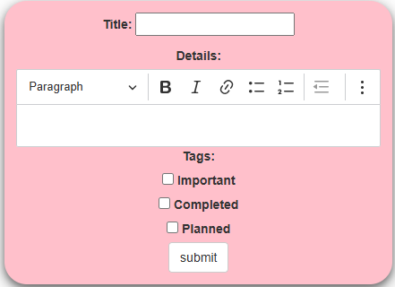

# Documentation

## Administration panel access

username = superadmin \
password = superadmin

## Features Implemented

### Rich Text Feature

We implemented the rich text feature that allows the user to better format the details of a task.

*Before implementation*


*After implementation*



### Sort, Filter and Search Feature

We implemented the sort, filter and search features that allows the user to apply these operations on the todo list elements

*Before implementation*


*After implementation*


### Email Notification

The mail notification system was implemented to send email to user when the due date of the task is near (in this case less than 7 days or a week). To implement this feature there are some requirements first we have to install the django-background-taks using the command below :

`pip install django-background-tasks`

After installing the module we need to add the "background_task" module in the INSTALLED_APPS in [settings.py](/todo_site/todo_site/settings.py#L41-L42). Run the known migrate command to update the database with the new module.

With a proper and complete installation of the background task module we have to move on to designing the logic in the view that plans the task depending on the due date and code the send mail notification task. To do so we write in the views file the following code after saving each task.

```python
task = form.save()
# Send email notification for due tasks
notify_at = task.due_date - timedelta(days=7)
# If the task is due day greater than a week
if notify_at >= now().date():
    notify_at = datetime.combine(notify_at, datetime.min.time())
    send_due_soon_email(task.id, schedule=notify_at)
else:
    send_due_soon_email(task.id, schedule=now() + timedelta(seconds=5))          
```

We create the send mail notification task in a tasks.py file that have to be located in the todo app.

```python
from django.core.mail import send_mail
from django.utils.timezone import now, timedelta, localtime, make_aware, datetime
from todo.models import Todo
from background_task import background

@background(schedule=60) # runs in 60 seconds from now unless rescheduled
def send_due_soon_email(task_id):
try:
    task = Todo.objects.get(id=task_id)
    # Convert due_date to datetime format
    due_datetime = make_aware(datetime.combine(task.due_date, datetime.min.time()))
    if task.due_date < now().date():
        return
    
    if task.tags == "Completed":
        return
    
    recipient_email = 'dilanechristian2@gmail.com'
    send_mail(
        subject=f"[Reminder] Task '{task.title}' is due on {localtime(due_datetime).strftime('%d %b %Y')}",
        message=f"Hello,\n\nThis is your daily reminder: the task \"{task.title}\" is due on {localtime(due_datetime).strftime('%A, %d %B %Y at %I:%M %p')}.\n\nStay focused!",
        from_email='noreply@yourapp.com',
        recipient_list=[recipient_email],  # Replace with user's email
        fail_silently=False,
    )
    # Reschedule the task for the next day
    send_due_soon_email(task_id, schedule=now() + timedelta(days=1))
except Todo.DoesNotExist:
        print(f"Task {task_id} does not exist.")
```

*After implementation*


Don't forget to always run the process tasks in background to track tasks for notification. This is done using the following command :

`python manage.py process_tasks`

### In-App Notification

To implement the In-App Notification, we had to work on five files. These files are tasks.py, models.py, views.py, index.html and urls.py.

In tasks.py, we added the following code to be sure upon scheduling the email notification one week close to the due date we also add an alert on the frontend of the application to notify the user along with the email. See [tasks.py](/todo_site/todo/tasks.py#L26-L30)

In models.py, we added a new object which is the notification object having the message, is_read, created_at and task fields.

- The message field contains the message that is displayed on the fronted informing the user on the corresponding task and it's due date.
- The is_read field contains the true or false status to track if the notification has been read or not.
- The created_at field just hold the date of the creation of the notification.
- The task field holds the corresponding task which due date is close.

See [models.py](/todo_site/todo/models.py#L68-L76) to have a view on the code.

In the views.py, we just called with a filter method on the notification object all the notifications with the *is_read* status as False. See [views.py](/todo_site/todo/views.py#L114-L115)

In the index.html, we added some html components alongside with interesting bootstrap features to display a notification button with an alert icon and a counter. We can see the code at [index.html](/todo_site/todo/templates/todo/index.html#L133-L154). In the same file we added some javascript to update the is_read field of the notification so as the update is executed after the user has clicked on the "Mark as read" button. We can see the script here, [index.html](/todo_site/todo/templates/todo/index.html#L289-L319).

*After Implementation*


### Data backup and restore

Data management is important in all application in our days. In our case we implemented this management with the data import and export features. We can see below the steps for data import :


- The user has to click on the Import Tasks button and select either a csv or json file corresponding to our data schema.


The data schema to follow for the json and csv format are as follow : 

```json
[
    {
        "Title": "Title 5",
        "Details": "<p>det</p>",
        "Due Date": "2025-06-16",
        "Priority": 3,
        "Date": "2025-06-01 09:48:01+00:00",
        "Tags": [
            "Important",
            "Planned"
        ],
        "Is Recurring": true,
        "Recurrence Interval": "weekly"
    }
]
```

Here below is a screenshot of the csv file following the data schema:


To implement these features we had to work on multiple files (views.py, urls.py and index.html) and installed a new python module called pandas.

In the views.py we added the import and export view functions that handle the action of importing csv or json files and exporting data in the two known format after a click on the corresponding button. We can see more details on the following link to the code [views.py](/todo_site/todo/views.py#L143-L218)

In the urls.py we added the two url links that will be used for export and import as shown below.

```python
    path('export/<str:format>/', views.export_tasks,name="export_tasks"),
    path('import/', views.import_tasks, name="import_tasks")
```

Finally we redesigned the frontend on the index.html to add the import and export buttons at the end of the form used to add a task. Click on the following link for more details [index.html](/todo_site/todo/templates/todo/index.html#L278-L292)

```html
<!-- For import -->
    <form id="import-form" method="POST" enctype="multipart/form-data" action="" style="display: none;">
        
        <input type="file" name="import_file" id="import-file" accept=".json,.csv" onchange="document.getElementById('import-form').submit();">
    </form>

    <center>
        <button type="button" class="btn btn-success" onclick="document.getElementById('import-file').click();">
            Import Tasks
        </button>
    </center>

<!-- For export -->
    <div class="text-center" style="margin: 20px 0;">
        <a href="" class="btn btn-sm btn-outline-primary">Export CSV</a>
        <a href="" class="btn btn-sm btn-outline-secondary">Export JSON</a>
    </div>
```
